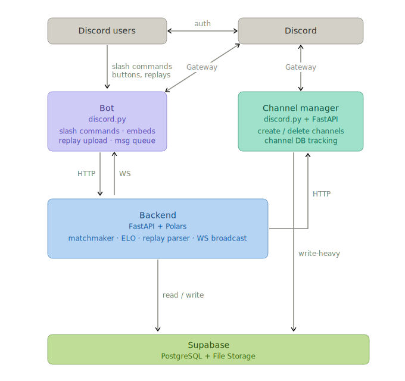

# EvoLadderBotBeta

EvoLadderBot is a Discord-based ranked matchmaking system for [SC: Evo Complete](https://scevo.net/), a StarCraft II mod. SC: Evo Complete brings the StarCraft races into StarCraft II, faithfully recreating their essence while rebalancing them for competitive cross-game play. EvoLadderBotBeta is currently the most up-to-date version of this project and reflects significant refactoring efforts from the original [alpha](https://github.com/HyperONE27/EvoLadderBot) codebase.

StarCraft II's binary cannot be modified, and it exposes no lobby automation API. While rudimentary ratings can be maintained via StarCraft II's data bank system, these ratings cannot be transferred to other regions or computers. Building a real ranked ladder means building it outside the game entirely.

A Discord-based solution was natural: Discord is a gamer-native platform already used extensively by the StarCraft community. Players queue in the ladder bot's DMs, get matched by MMR, play in StarCraft II, upload replays, and see results in seconds.

Supports 1v1 and 2v2 game modes, with extensibility to other modes.

## How It Works

Three processes run together:



- **Bot** handles all Discord interaction (slash commands, buttons, DMs, replay uploads) and calls the backend over HTTP.
- **Backend** is the single source of truth. Loads the full database into Polars DataFrames at startup for sub-millisecond reads. Writes go to Supabase first, then update memory (write-through). Pushes real-time events to the bot over WebSocket.
- **Channel Manager** creates and deletes Discord text channels for active matches. Called by the backend; also reads/writes Supabase directly.

Matchmaking runs every 60 seconds. It uses an ELO-like system (K=40, default 1500 MMR) with the Hungarian algorithm for optimal pairing.

## Setup

Requires Python 3.14+ and [uv](https://docs.astral.sh/uv/).

```bash
git clone https://github.com/HyperONE/EvoLadderBotBeta.git
cd EvoLadderBotBeta
uv sync
```

Copy `.env.example` to `.env` and fill in the values.

### Backend

| Variable | Required | Description |
|---|---|---|
| `SUPABASE_URL` | yes | Supabase project URL |
| `SUPABASE_ANON_KEY` | yes | Supabase anonymous key (read) |
| `SUPABASE_SERVICE_ROLE_KEY` | yes | Supabase service role key (write) |
| `SUPABASE_BUCKET_NAME` | yes | Supabase Storage bucket for replays |
| `CHANNEL_MANAGER_URL` | no | Channel manager base URL; if unset, channel creation is skipped |
| `REPLAY_WORKER_PROCESSES` | no | Replay parser worker count (default: 2) |

### Bot

| Variable | Required | Description |
|---|---|---|
| `BOT_TOKEN` | yes | Discord bot token |
| `BACKEND_URL` | yes | Backend base URL |
| `MATCH_LOG_CHANNEL_ID` | yes | Discord channel ID for match log posts |
| `BOT_ICON_URL` | no | HTTPS URL for branded embed footer icon |

### Channel Manager

| Variable | Required | Description |
|---|---|---|
| `CHANNEL_MANAGER_BOT_TOKEN` | yes | Discord bot token (may differ from the bot's token) |
| `SUPABASE_URL` | yes | Supabase project URL (shared with backend) |
| `SUPABASE_SERVICE_ROLE_KEY` | yes | Supabase service role key (shared with backend) |
| `DISCORD_GUILD_ID` | yes | Guild where match channels are created |
| `DISCORD_CHANNEL_CATEGORY_ID` | yes | Category under which match channels are created |
| `DISCORD_STAFF_ROLE_IDS` | no | Comma-separated role IDs granted access to match channels |
| `CHANNEL_DELETION_DELAY_SECONDS` | no | Seconds to wait before deleting a channel (default: 0) |

Then run all three processes:

```bash
make run
```

## Development

```bash
# Lint, format, type-check, and test
make quality

# Tests only
uv run python -m pytest tests/ -v
```

`make quality` runs ruff (check + format), mypy across `backend/ bot/ channel_manager/ common/`, then pytest. CI runs the same checks on push/PR to main.

## Project Structure

```
backend/
  api/          # FastAPI app, endpoints, WebSocket
  orchestrator/ # State management, transitions (writethrough to Supabase)
  algorithms/   # Matchmaker, MMR, replay parser/verifier, match params
  database/     # Supabase read/write/storage clients
  domain_types/ # Polars schemas, TypedDicts, ephemeral types
  lookups/      # Read-only query modules (players, matches, mmr, etc.)
  core/         # Config, bootstrap

bot/
  commands/     # Slash commands (user/, admin/, owner/)
  components/   # Discord UI components (embeds, views, modals)
  helpers/      # Permission checks, branding, utilities
  core/         # App entry point, WS listener, message queue

channel_manager/  # Standalone FastAPI service for Discord channel lifecycle

common/         # Shared between backend and bot (i18n, datetime helpers, loader)
data/
  core/         # Game data JSON (maps, races, countries, emotes)
  locales/      # Translations (enUS, koKR, ruRU, esMX, zhCN)
tests/          # Invariant-based test suite
```

## Slash Commands

**Player:** `/setup`, `/queue`, `/profile`, `/leaderboard`, `/activity`, `/notifications`, `/referral`, `/help`, `/party invite|leave|status`, `/setcountry`

**Admin:** `/ban`, `/snapshot`, `/match`, `/resolve`, `/statusreset`

**Owner:** `/admin`, `/mmr`, `/announcement`

## License

Private. Not open source.
